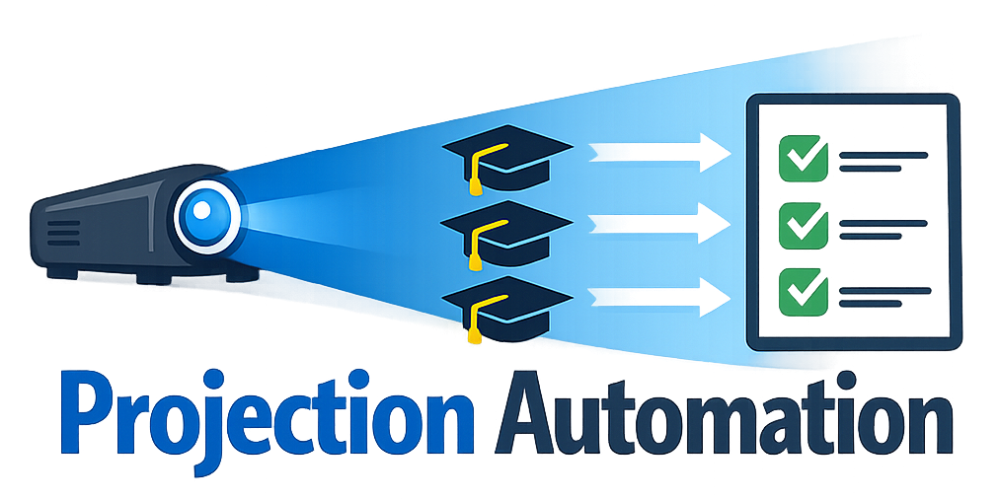

<a id="readme-top"></a>
<!-- PROJECT SHIELDS -->
<!--
*** I'm using markdown "reference style" links for readability.
*** Reference links are enclosed in brackets [ ] instead of parentheses ( ).
*** See the bottom of this document for the declaration of the reference variables
*** for contributors-url, forks-url, etc. This is an optional, concise syntax you may use.
*** https://www.markdownguide.org/basic-syntax/#reference-style-links
-->
[![Contributors][contributors-shield]][contributors-url]
[![Forks][forks-shield]][forks-url]
[![Stargazers][stars-shield]][stars-url]
[![Issues][issues-shield]][issues-url]
[![project_license][license-shield]][license-url]
[![LinkedIn][linkedin-shield]][linkedin-url]


<!-- PROJECT LOGO -->
<br />
<div align="center">
  <a href="https://github.com/OlsonTyler0/Projection-Automation">
    
  </a>

<h3 align="center">Graduate Projection Automation</h3>

  <p align="center">
    Automates student course projections management for graduate programs using Excel and VBA.
    <br />
    <br />
    <a href="https://github.com/OlsonTyler0/Projection-Automation">View Demo</a>
    &middot;
    <a href="https://github.com/OlsonTyler0/Projection-Automation/issues/new?labels=bug">Report Bug</a>
    &middot;
    <a href="https://github.com/OlsonTyler0/Projection-Automation/issues/new?labels=enhancement">Request Feature</a>
  </p>
</div>


<!-- TABLE OF CONTENTS -->
<details>
  <summary>Table of Contents</summary>
  <ol>
    <li>
      <a href="#about-the-project">About The Project</a>
    </li>
    <li>
      <a href="#getting-started">Getting Started</a>
      <ul>
        <li><a href="#installation">Installation</a></li>
      </ul>
    </li>
    <li><a href="#usage">Usage</a></li>
    <li><a href="#roadmap">Roadmap</a></li>
    <li><a href="#contributing">Contributing</a></li>
    <li><a href="#license">License</a></li>
    <li><a href="#contact">Contact</a></li>
  </ol>
</details>


<!-- ABOUT THE PROJECT -->
## About The Project

This project was created to assist with the Missouri State University's Graduate Program Office with automating taking student projections and turning them into data regarding the coruses for each semester to help plan course capacity. 

This is a script intended to be used with excel sheets historically used by the graduate office but has been made pretty modular.

<p align="right">(<a href="#readme-top">back to top</a>)</p>


<!-- GETTING STARTED -->
## Getting Started

### Installation

1. Clone the repository
   ```sh
   git clone https://github.com/OlsonTyler0/Projection-Automation.git
   ```
   ALTERNATIVELY: Copy the data from UpdateMustHave.vba into your clipboard and do the following:
2. Open your Excel workbook in which you want to use this system
3. Open the VBA Editor (Alt + F11)
4. Copy the content from `UpdateMustHaveClasses.vba` into a new module in your workbook
5. _(Optional)_ Copy content from `DebugResetProjections.vba` into another module for testing/reset capabilities
6. Save the workbook as `.xlsm` (macro-enabled format)

<p align="right">(<a href="#readme-top">back to top</a>)</p>


<!-- USAGE EXAMPLES -->
## Usage

### Basic Workflow

1. **Prepare your data:**
   - Import your data into excel using `Data -> Get Data -> From File -> Excel -> Projections sheet` imported sheet will be titled 'imported-data'
   - Ensure columns are named: M#, Name, Fall 2026, Spring 2027, etc.
   - Make a copy of the current excel sheet, always keep a backup! This will add data to your sheet!

2. **Import the VBA script into excel**
    - Using the desktop program you can press `ALT + F11` Then you can insert this module through Insert -> Module and copy UpdateMustHave.vba content into that file. Make sure to save!

2. **Run the import:**
    - Using `ALT + F8` select "SetupDashboard" OR "ImportProjections" to start the script and allow it to change data.
   - The script will:
     - Read all course sheets (ACC 711 - FA26, MGT 534 - SP26, etc.)
     - Match students from imported-data to course sheets
     - Update Must Have (Yes/No) based on graduation semester
     - Auto-populate "Graduating SEMESTER" notes
     - Flag students no longer projected

3. **Review results:**
   - Check the Dashboard for enrollment summaries
   - Review Notes column (D) for graduation dates

### Data Format Example

**imported-data sheet:**
```
M#          | Name        | Fall 2026    | Spring 2027 | Summer 2027
EX123456    | John Doe    | ACC 211      |             |
            |             | ITC 623      |             |
            |             | FIN 3432     | MGT 534     |
            |             |              |             |
            |             |              |             |
EX234567    | Jane Smith  | ACC 211      | MGT 534     |
```

**Course sheet (e.g., "ACC 711 - FA26"):**
```
M#          | Name        | Must Have (Yes/No) | Notes
EX123456    | John Doe    | No                 |
EX234567    | Jane Smith  | Yes                | Graduating FA26
```

<p align="right">(<a href="#readme-top">back to top</a>)</p>


<!-- ROADMAP -->
## Roadmap

- [x] Dashboard design
- [x] Script dictionary of classes per student
- [x] Placing students in class based on prediction 
- [x] Dashboard statistics

See the [open issues](https://github.com/OlsonTyler0/Projection-Automation/issues) for a full list of proposed features (and known issues).

<p align="right">(<a href="#readme-top">back to top</a>)</p>


<!-- CONTRIBUTING -->
## Contributing

Contributions are what make the open source community such an amazing place to learn, inspire, and create. Any contributions you make are **greatly appreciated**.

If you have a suggestion that would make this better, please fork the repo and create a pull request. You can also simply open an issue with the tag "enhancement".
Don't forget to give the project a star! Thanks again!

1. Fork the Project
2. Create your Feature Branch (`git checkout -b feature/AmazingFeature`)
3. Commit your Changes (`git commit -m 'Add some AmazingFeature'`)
4. Push to the Branch (`git push origin feature/AmazingFeature`)
5. Open a Pull Request

<p align="right">(<a href="#readme-top">back to top</a>)</p>

<!-- LICENSE -->
## License

Distributed under the MIT Lisence. See `LICENSE.txt` for more information.

<p align="right">(<a href="#readme-top">back to top</a>)</p>

<!-- CONTACT -->
## Contact

Tyler Olson - [@tyler-s-olson](https://linkedin.com/in/tyler-s-olson) - to329s@missouristate.edu

Project Link: [https://github.com/OlsonTyler0/Projection-Automation](https://github.com/OlsonTyler0/Projection-Automation)

<p align="right">(<a href="#readme-top">back to top</a>)</p>


<!-- MARKDOWN LINKS & IMAGES -->
<!-- https://www.markdownguide.org/basic-syntax/#reference-style-links -->
[contributors-shield]: https://img.shields.io/github/contributors/OlsonTyler0/Projection-Automation.svg?style=for-the-badge
[contributors-url]: https://github.com/OlsonTyler0/Projection-Automation/graphs/contributors
[forks-shield]: https://img.shields.io/github/forks/OlsonTyler0/Projection-Automation.svg?style=for-the-badge
[forks-url]: https://github.com/OlsonTyler0/Projection-Automation/network/members
[stars-shield]: https://img.shields.io/github/stars/OlsonTyler0/Projection-Automation.svg?style=for-the-badge
[stars-url]: https://github.com/OlsonTyler0/Projection-Automation/stargazers
[issues-shield]: https://img.shields.io/github/issues/OlsonTyler0/Projection-Automation.svg?style=for-the-badge
[issues-url]: https://github.com/OlsonTyler0/Projection-Automation/issues
[license-shield]: https://img.shields.io/github/license/OlsonTyler0/Projection-Automation.svg?style=for-the-badge
[license-url]: https://github.com/OlsonTyler0/Projection-Automation/blob/master/LICENSE.txt
[linkedin-shield]: https://img.shields.io/badge/-LinkedIn-black.svg?style=for-the-badge&logo=linkedin&colorB=555
[linkedin-url]: https://linkedin.com/in/tyler-s-olson